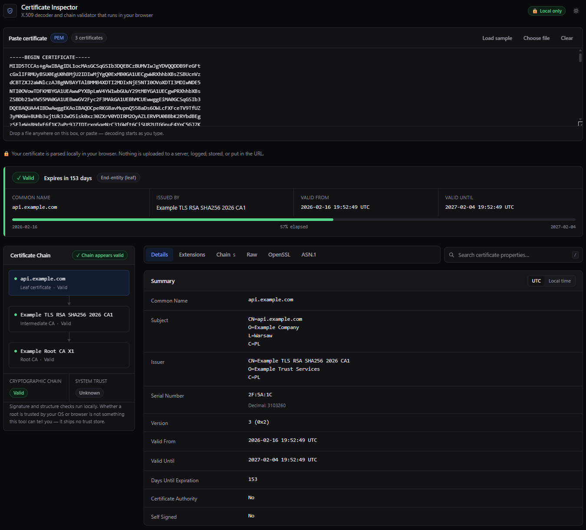

# Certificate Inspector

A web app for inspecting X.509 certificates. Paste a certificate, a Base64 blob, a DER
file or a whole chain; the format is detected automatically and every property is laid
out in a readable form.

**Everything runs in the browser.** Certificates are parsed with WebCrypto and pkijs on
the client. Nothing is uploaded, logged, stored, sent to analytics or put in the URL.

That is not just a promise. The app is a static export, so the published container has no
application runtime at all — nginx serving a directory of files. There is no endpoint that
could receive a certificate, and the shipped Content-Security-Policy sets
`connect-src 'none'`, which makes the browser refuse any outbound `fetch`, XHR, WebSocket
or beacon from the page.

## License

This project is licensed under the GNU General Public License v3.0.
See the [LICENSE](LICENSE) file for the full text.

## Screenshot



## Features

- **Format detection** — PEM, raw Base64, Base64 that wraps a whole PEM file, hex, binary
  DER, several certificates concatenated, and PKCS#7 / `.p7b` bundles. No "which format is
  this?" step.
- **Summary** — subject, issuer, serial (hex and decimal), version, validity, days
  remaining, CA and self-signed flags.
- **Validity** — UTC or local time, validity period, and a bar showing how much of the
  window has elapsed.
- **SANs** — DNS, IP (v4 and v6), URI, email, directory and other names, each typed and
  copyable.
- **Public key** — algorithm, size, RSA exponent and modulus, EC curve, OIDs.
- **Signature** — algorithm, hash, OID, value, and a warning on MD5/SHA-1.
- **Key Usage / Extended Key Usage** — decoded to named flags, not raw bits.
- **Basic Constraints** — so you can tell a leaf from an intermediate from a root at a
  glance.
- **Fingerprints** — SHA-256 and SHA-1, with or without colons.
- **Extensions** — every extension, decoded where possible, with OID and critical flag.
- **Chain building and validation** — certificates are ordered into a chain and each hop
  is checked: issuer/subject match, AKI/SKI match, and the actual signature.
- **Chain diagnostics** — missing intermediates, wrong order, duplicates, expired members,
  self-signed leaves, CA certificates without `CA:TRUE`, leaves *with* `CA:TRUE`, and
  unrelated certificates.
- **Raw / OpenSSL / ASN.1 views** — the original PEM, an `openssl x509 -text` style
  rendering, and a navigable ASN.1 tree with byte offsets.
- **Search** — filter every property by name or value.
- **Private key detection** — a prominent warning if you paste a key by mistake.
- Dark and light themes, responsive layout, copy buttons on every technical value.

### What it deliberately does not claim

Verifying the signatures in a chain proves the certificates are cryptographically related.
It says nothing about whether your operating system or browser *trusts* the root. The app
ships no trust store, so it reports **Cryptographic chain: valid** and **System trust:
unknown** separately, and never says "trusted".

## Run it

### With Docker

```bash
docker run --rm -p 8080:8080 YOUR_DOCKERHUB_USER/certificate-inspector:latest
```

Then open <http://localhost:8080>.

The image runs as an unprivileged user (UID 101) on port 8080 and needs no capabilities,
no writable filesystem and no network access of its own:

```bash
docker run --rm -p 8080:8080 \
  --read-only \
  --cap-drop ALL \
  --security-opt no-new-privileges \
  --tmpfs /tmp:mode=1777,size=16m \
  --tmpfs /var/cache/nginx:mode=1777,size=16m \
  YOUR_DOCKERHUB_USER/certificate-inspector:latest
```

Or with Compose, which applies that hardening for you:

```bash
docker compose up --build
```

`GET /healthz` returns `ok` for liveness and readiness probes. The image also declares a
`HEALTHCHECK`, so `docker ps` reports health without any extra configuration.

### From source

```bash
npm install
```

```bash
npm run dev
```

Then open <http://localhost:3000>. Use **Load sample** to generate a throwaway three
certificate chain in the browser and see every feature without pasting anything real.

To check the production build exactly as the container serves it — same files, same
security headers, no Docker required:

```bash
npm run build && npm run preview
```

`scripts/preview.mjs` parses the headers out of `docker/security-headers.conf` rather than
restating them, so the preview cannot drift away from what nginx actually sends.

## Scripts

| Command | What it does |
| --- | --- |
| `npm run dev` | Development server |
| `npm run build` | Static export to `out/` |
| `npm run preview` | Serve `out/` with the production security headers |
| `npm test` | Run the parser test suite |
| `npm run typecheck` | TypeScript, no emit |
| `npm run lint` | ESLint |
| `npm run check` | Types, lint and tests together |

There is no `npm start`: `output: 'export'` produces static files, so there is no Next.js
server to run. Serve `out/` with anything, or use the image.

## Continuous integration and publishing

[`.github/workflows/ci.yml`](.github/workflows/ci.yml) runs on every push and pull
request:

1. **verify** — type check, lint, the full test suite, and the static export build.
2. **image** — builds the container, starts it with the hardened flags above, and smoke
   tests it: the page is served, the JS bundle loads, the security headers are present,
   an unknown path returns 404 rather than 200, and the process is not root. Then Trivy
   scans it and fails the build on a fixable HIGH or CRITICAL finding.

Only after all of that, and only for pushes to `master` or a `v*.*.*` tag, does it build for
`linux/amd64` and `linux/arm64` and push to Docker Hub. Pull requests build and test the
image but never publish.

### Vulnerability scanning

There are two surfaces here and one scanner cannot see both.

**The image** — Alpine packages and nginx — is scanned by Trivy on every run, before
anything is published. Findings with no upstream fix are ignored on purpose: a gate nobody
can satisfy is a gate everybody learns to click past.

The runtime stage runs `apk upgrade` for the same reason the scan exists. Packages inside a
base image are as old as its last rebuild, which is somebody else's schedule: when this was
added, `1.29-alpine` carried 33 fixable HIGH advisories in curl, openssl, util-linux, expat,
libxml2 and c-ares, all of them already patched in the Alpine branch the image points at.
Taking those at build time drops the count to zero. It costs reproducibility — two builds of
one commit are no longer byte-identical — which is why the smoke test runs against the exact
image that gets published.

**The dependencies** — `pkijs`, `asn1js`, React, Next — are invisible to that scan. A
static export leaves no `node_modules` in the image; those libraries are minified into the
JS chunks, where no scanner can recover a package name or version. They are covered from
`package-lock.json` by [Dependabot](.github/dependabot.yml) instead, which also watches the
GitHub Actions used here and the base images in the Dockerfile.

### Branches

`master` is what gets published. `dev` is where dependency updates are integrated:
Dependabot opens its pull requests there, majors that need coordinating — a compiler and its
lint plugins, a test runner and its coverage provider — are worked out on that branch, and
only a green `dev` is merged into `master`.

Both branches get the same pipeline: verify, build, smoke test, scan. Only `master` and
`v*.*.*` tags publish, so nothing half-migrated can be pulled from Docker Hub.

Security updates are the exception and deliberately so: Dependabot always raises those
against the default branch, ignoring `target-branch`, so an advisory reaches `master`
directly instead of queuing behind a migration.

### Weekly rebuild

A published image ages while its source stands still, because fixes reach `1.29-alpine`
long after the tag stops moving in the Dockerfile. The workflow therefore also runs on a
schedule, and on that path only it builds with `--pull --no-cache`: with the layer cache in
play the rebuild would produce a byte-identical image and achieve nothing.

That refreshes `edge`. It deliberately does **not** refresh `latest`, which is pinned to the
commit a release was cut from — moving it would break the promise that `1.0.0` is one exact
artifact. When a scan or a rebuild turns up something that matters, the answer is to cut a
patch release, which is two commands and leaves a version number behind saying what changed.

### Setting up Docker Hub publishing

Add these under **Settings → Secrets and variables → Actions**:

| Kind | Name | Value |
| --- | --- | --- |
| Secret | `DOCKERHUB_USERNAME` | Your Docker Hub username |
| Secret | `DOCKERHUB_TOKEN` | A Docker Hub **access token** (Account Settings → Personal access tokens), not your password |
| Variable | `DOCKERHUB_IMAGE` | Optional. Full repository name, e.g. `myuser/x509-inspector`. Defaults to `<username>/certificate-inspector` |

Until those exist the workflow still runs — it builds and smoke tests the image, then logs
a notice that it is skipping the push. Nothing goes red just because publishing is not set
up yet.

Give the access token **Read & Write** scope on the target repository only. It never needs
account-wide delete permission.

The text for the Docker Hub page lives in [`docker/DOCKERHUB.md`](docker/DOCKERHUB.md) and is
pasted into the repository overview by hand. It is not synced by the workflow on purpose:
Docker Hub accepts an access token for pushing images but answers `403 Forbidden` when the
same token tries to write the description, so automating it would mean giving CI the account
password — a credential that can delete every repository the account owns, traded for a
paragraph that changes a couple of times a year.

### Tags produced

| Trigger | Tags |
| --- | --- |
| Push to `master` | `edge`, `master`, `sha-<short>` |
| Tag `v1.4.2` | `1.4.2`, `1.4`, `1`, `latest`, `sha-<short>` |
| Pull request | Built and tested, not pushed |

`latest` follows releases only, so `docker pull` without a tag never returns
unreleased code. The tip of `master` is published as `edge` instead. Note the
consequence: until the first `v*.*.*` tag exists there is no `latest` at all.

`1` and `1.4` move as new patches land and exist for unattended updates. `1.4.2`
is a promise and should not be re-pushed once released. Only the digest is
enforced as immutable, so pin production deployments to it:

```
myuser/certificate-inspector@sha256:...
```

To cut a release:

```bash
npm version minor -m "Release v%s"
git push --follow-tags
```

That bumps `package.json`, commits, and creates an annotated `v0.2.0` tag, which
the workflow turns into the semver tags above. Release candidates named
`v1.0.0-rc.1` build and publish normally but are never tagged `latest`.

## Architecture

Parsing is completely separate from React, so it can be tested and reused without a DOM:

```
src/lib/certificate/
├── detect-format.ts     input classification, PEM extraction, DER header reading
├── decode-input.ts      the unwrapping pipeline (base64 → PEM → DER, PKCS#7)
├── parse-certificate.ts pkijs Certificate → our own model
├── parse-extensions.ts  extension decoding
├── names.ts             distinguished names and general names
├── build-chain.ts       ordering certificates into a chain
├── validate-chain.ts    per-hop checks and diagnostics
├── asn1-tree.ts         ASN.1 walker with byte offsets
├── openssl-view.ts      `openssl x509 -text` style rendering
├── fingerprint.ts       WebCrypto digests
├── encoding.ts          hex/base64/PEM/date helpers
├── oids.ts              OID dictionaries
└── types.ts             the unified model the UI consumes
```

`analyzeInput(input)` in `src/lib/certificate/index.ts` is the single entry point: raw
input in, everything the app displays out. The UI never touches a pkijs object — the
parser translates library output into `ParsedCertificate` first, so swapping the crypto
library would not ripple into components.

Cryptography is not hand-rolled: [pkijs](https://pkijs.org) and
[asn1js](https://github.com/PeculiarVentures/ASN1.js) handle X.509 and ASN.1, and
signature verification and digests go through WebCrypto.

### The container

```
Dockerfile               multi-stage: node builds the export, nginx serves it
docker/default.conf      server block, caching, health endpoint, routing
docker/security-headers.conf  CSP and friends, included by every location
```

The Node stages are pinned to `$BUILDPLATFORM`. The export is plain HTML and JavaScript,
identical on every architecture, so the arm64 image reuses the same build output instead of
running npm under emulation — multi-arch costs almost nothing.

nginx's `add_header` does not merge: a `location` that sets any header of its own silently
discards everything inherited from the server block. That is why the headers live in a
snippet that every location includes, instead of being declared once at the top.

### Tests

```bash
npm test
```

The suite generates real certificates with pkijs at test time — valid, expired,
not-yet-valid, RSA, ECC, SHA-1 signed, self-signed, CA and non-CA, plus a forged signature
— and runs the parser, chain builder and validator against them. Malformed input (missing
PEM footers, truncated Base64, invalid characters, pasted private keys) is covered too.

## Browser support

Requires WebCrypto, which browsers only expose in a secure context: `https://` or
`localhost`. If you put the container behind a reverse proxy, terminate TLS there — over
plain `http://` on a remote host the page will report that WebCrypto is unavailable.

## Not implemented

- PKCS#12 / `.pfx` (detected and explained, but not decrypted)
- CSR inspection (detected and explained)
- Fetching a chain from a live TLS server — that needs a backend
- Comparing two certificates
